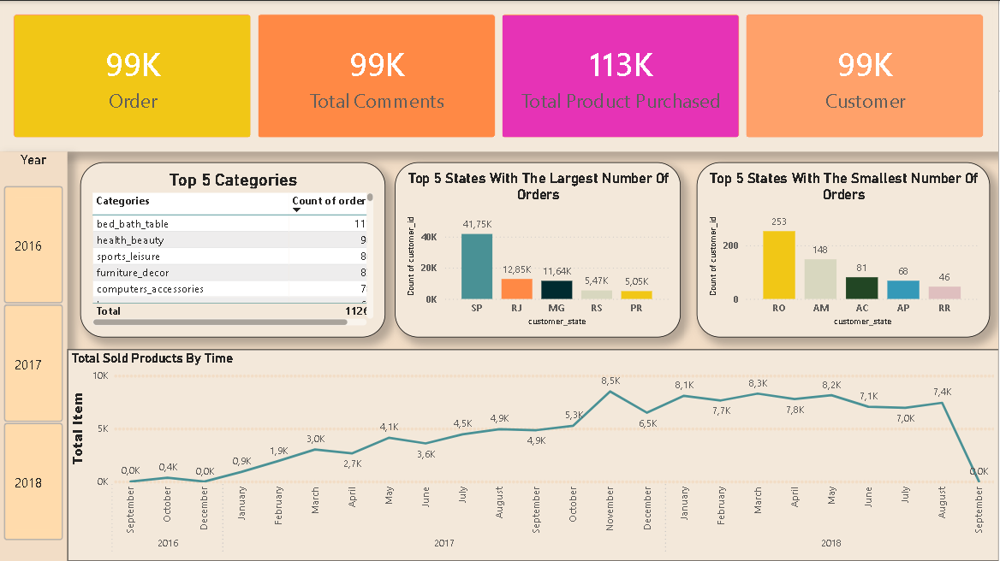
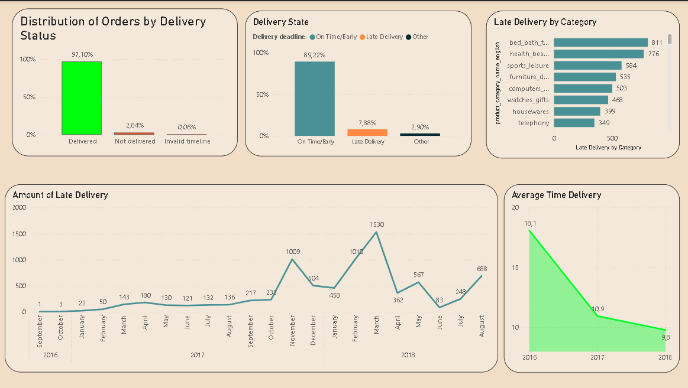
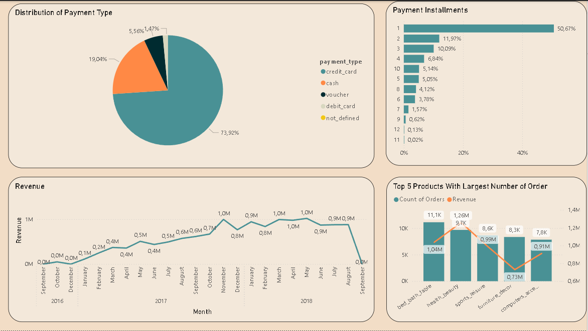
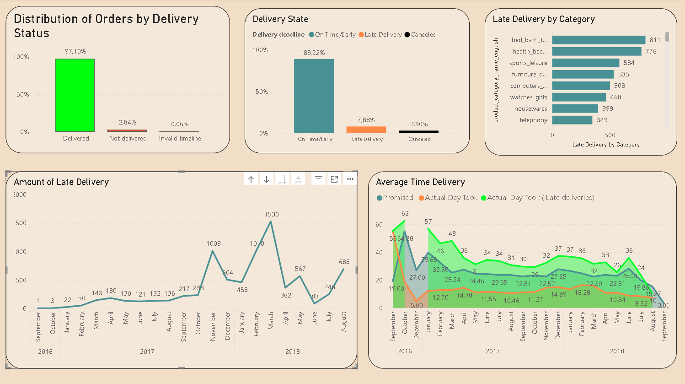
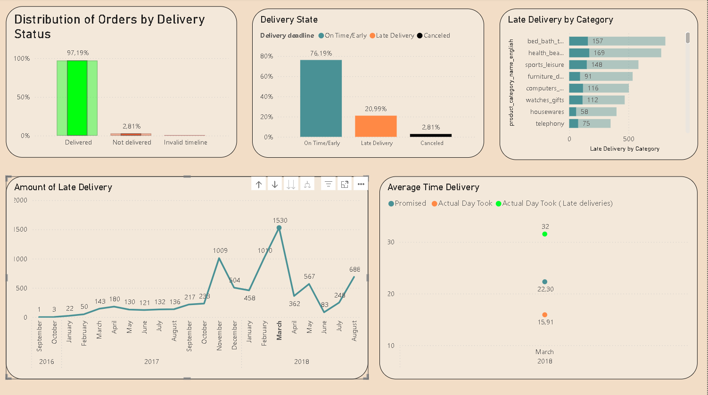

# 📊 E-commerce Case Study: Solving the Logistics Puzzle (2016-2018)

## 📌 Project Goals

The main goal of this project was not just to build a dashboard, but to investigate a massive surge in delivery delays during early 2018. I analyzed over 99K orders to find out if the problem was regional, product-related, or a data quality issue.

## 🛠 Solving Data & Model Problems

Before I could find the real insights, I had to fix the "broken" parts of the data model:

Fixing Relationships: I discovered that the customer table had an Inactive Relationship with the orders table, which caused all geographic charts to show identical, incorrect values. I activated the link to enable real-time filtering by state.

Cross-Filtering (Snowflake Schema): Because Category data was hidden deep in the product_summarize table, I used DAX (RELATED & CROSSFILTER) to bridge the gap between products and orders. This fixed the "equal bars" problem and showed the real differences between categories.
Late Delivery by Category =
CALCULATE(
[Late Delivery Count],
CROSSFILTER(orders[order_id], order_items[order_id], Both)
)
Data Quality (Invalid Timelines): I identified a "dirty data" problem. Approximately 0.06% of orders had impossible dates (e.g., delivery recorded before the purchase happened). I isolated these Invalid Timelines to keep my reports accurate.

## 📊 Dashboard Overview

### Page 1: General Business Health (Total Information)

Total Orders: 99.44K.

Total Customers: 99.44K.

Main Hub: São Paulo (SP) accounts for the vast majority of transactions.

### Page 2: Delivery Investigation (Deliver Info)

Late Delivery Rate: Jumped from ~15% in February to 20.99% in March.

Visual Proof: This page shows the exact moment when the "Amount of Late Delivery" line hit its historic peak.

### Page 3: Money & Payments (Order and Transaction)

Payment Dominance: 73.92% of Brazilians prefer Credit Cards.

Installments: Even for small purchases, customers often split payments into multiple parts, though 1-installment is most common (50.67%).

# 🕵️‍♂️ The Investigation: What happened in early 2018?

1. February 2018: The "Computer Accessories" Bug
   While overall delays were low in February, my category-specific analysis showed that Computers Accessories was the only category experiencing significant friction. This was a "local" problem, likely tied to a specific supplier or a customs delay for electronics.
   

2. March 2018: The Systemic Collapse
   In March, everything changed. The number of late deliveries skyrocketed to 1,530 orders.
   

Not a State Problem: By clicking on the March peak, I saw that the delay affected all states (SP, RJ, MG, etc.) proportionally.

Not a Category Problem: Unlike February, in March every category started failing (Bed/Bath/Table, Health/Beauty, etc.).

The "EDD" (Estimated Delivery Date) Insight: Interestingly, the Average Delivery Time in March was 11.6 days—which is actually faster than in February (12.8 days).

Conclusion: The logic of the system's "promised dates" (EDD) failed. The system promised customers dates that were too aggressive for a busy season like Carnival, turning even "fast" deliveries into "late" ones.

## 💡 Final Summary

Through this project, I proved that data analysis isn't just about counting totals—it's about investigating anomalies. I was able to show that the March 2018 crisis was caused by a broken estimation system, not by slow trucks or specific bad products.
